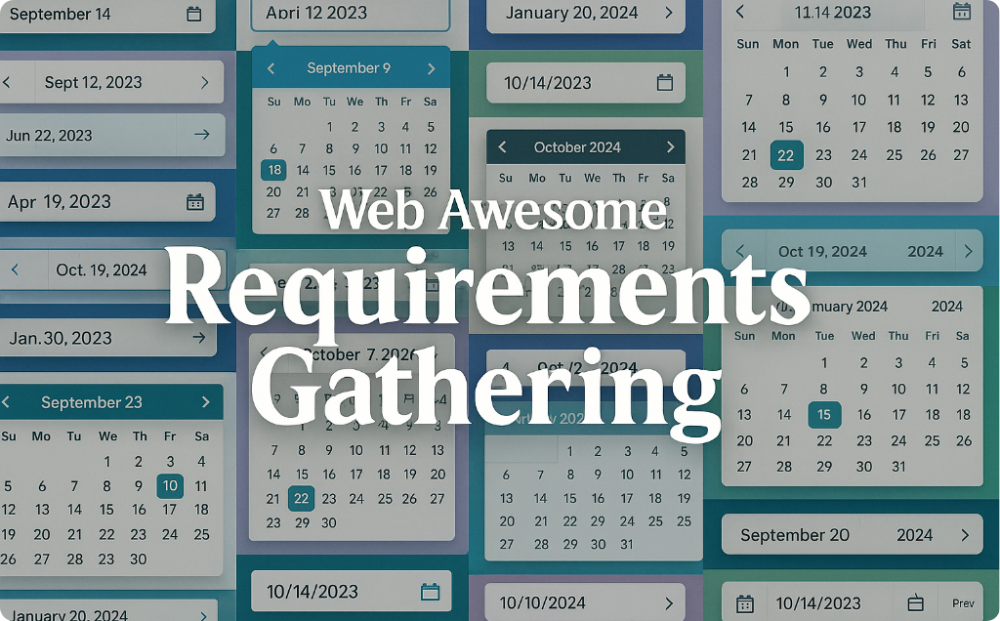

# Web Awesome date picker requirements gathering

My write up of guidance for the [Web Awesome](https://github.com/shoelace-style/webawesome) [OSS](https://en.wikipedia.org/wiki/Open-source_software) community and devs for writing the requirements for the date picker component.

> **What Is Web Awesome?**\
 **A major open‑source library**: Web Awesome bills itself as "the biggest open‑source library of meticulously designed, highly customizable, and framework‑agnostic UI components."\
> **Framework‑agnostic**: You can drop these components into plain HTML pages or integrate them seamlessly into frameworks like React, Vue, or Angular.\
> **Built on modern standards**: The components are built with [Web Components](https://developer.mozilla.org/en-US/docs/Web/API/Web_components) and Google's [LitElement](https://lit.dev/docs/) lightweight library, ensuring they're native, modular, and performant.\
> **Accessibility and customization**: Designed to be accessible, fully themeable, and easily tuned to match your brand or style preferences.\
> Read more about Web Awesome here: [WebAwesome.com](https://webawesome.com/)

The date picker development is being discussed here: [discussion for feature suggestions and planning](https://github.com/shoelace-style/webawesome/discussions/935)

The issue tracking for upcoming work on Web Awesome components is located here: https://github.com/shoelace-style/webawesome/issues/1075

---

The files in this repo:

[ Introduction to Web Awesome date picker requirements gathering](Introduction-to-web-picker-requirements-gathering.md)

[1) What to gather before writing requirements](1-What-to-gather-before-writing-requirements.md)

[2) Date Picker Landscape scan - how others do it (highlights)](2-Date-Picker-landscape-scan-how-others-do-it.md)

[3) Master list of possible features (pick what matters)](3-Master-list-of-possible-features.md)

[4) Prioritize: Essential vs "most wanted" vs "nice-to-have"](4-Prioritize-essential-vs-most-wanted-vs-nice-to-have.md)
